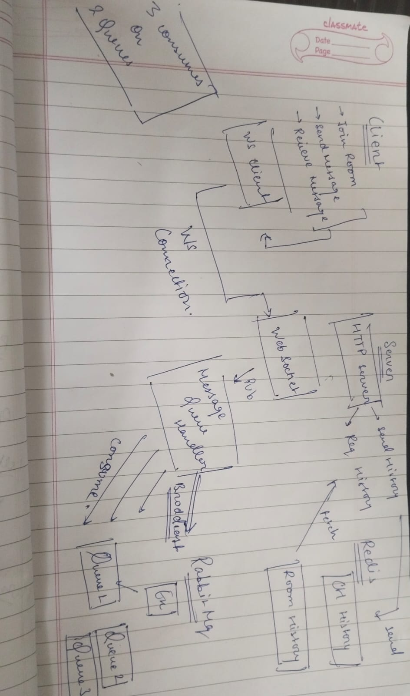

## Real time chat application 

# Real-Time Chat Application with Message Queue and Caching

A scalable real-time chat application built using Golang, Redis, RabbitMQ, WebSockets, and JavaScript. This project demonstrates the integration of message queues and caching mechanisms to facilitate efficient and reliable communication between clients.([GitHub][1])



## Features

* **Real-Time Communication**: Utilizes WebSockets to enable instant messaging between users.
* **Message Queue Integration**: Incorporates RabbitMQ to manage and route messages efficiently.
* **Caching Mechanism**: Employs Redis for caching messages and managing pub/sub functionalities.
* **Scalable Architecture**: Designed to handle multiple concurrent users with ease.
* **Dockerized Setup**: Provides a Docker Compose configuration for easy deployment.

## Technologies Used

* **Backend**: Golang
* **Frontend**: JavaScript, HTML
* **Message Broker**: RabbitMQ
* **Caching**: Redis
* **WebSockets**: For real-time communication
* **Containerization**: Docker, Docker Compose([GitHub][2], [GitHub][3])

## Prerequisites

* [Docker](https://www.docker.com/get-started) installed on your machine.
* [Docker Compose](https://docs.docker.com/compose/install/) installed.

## Getting Started

1. **Clone the Repository**:

   ```bash
   git clone https://github.com/saivedavyas/real-time-chat-app-using-redis.git
   cd real-time-chat-app-using-redis
   ```


2. **Build and Run the Application**:

   ```bash
   docker-compose up --build
   ```


This command will set up the Golang server, Redis, and RabbitMQ containers.

3. **Access the Application**:

   Open your browser and navigate to `http://localhost:8080` to use the chat application.

## Project Structure

```plaintext
chat-redis-app/
├── Dockerfile
├── docker-compose.yml
├── go.mod
├── go.sum
├── main.go
├── static/
│   ├── index.html
│   └── app.js
└── banner.jpeg
```


* **Dockerfile**: Defines the Docker image for the Golang application.
* **docker-compose.yml**: Sets up the multi-container Docker application, including Redis and RabbitMQ.
* **main.go**: Contains the backend server code written in Golang.
* **static/**: Holds the frontend files (HTML and JavaScript).
* **banner.jpeg**: Visual representation of the system design.

## Usage

* Open multiple browser tabs or windows and navigate to `http://localhost:8080`.
* Enter a username to join the chat.
* Start sending messages; they will appear in real-time across all connected clients.

## Contributing

Contributions are welcome! Please fork the repository and submit a pull request for any enhancements or bug fixes.

## License

This project is licensed under the MIT License. See the [LICENSE](LICENSE) file for details.

---

For more information, visit the [chat-redis-app GitHub repository](https://github.com/saivedavyas/real-time-chat-app-using-redis).


Technologies Used: Golang, Redis, RabbitMQ, Websocket, and Javascript

System Design : 

